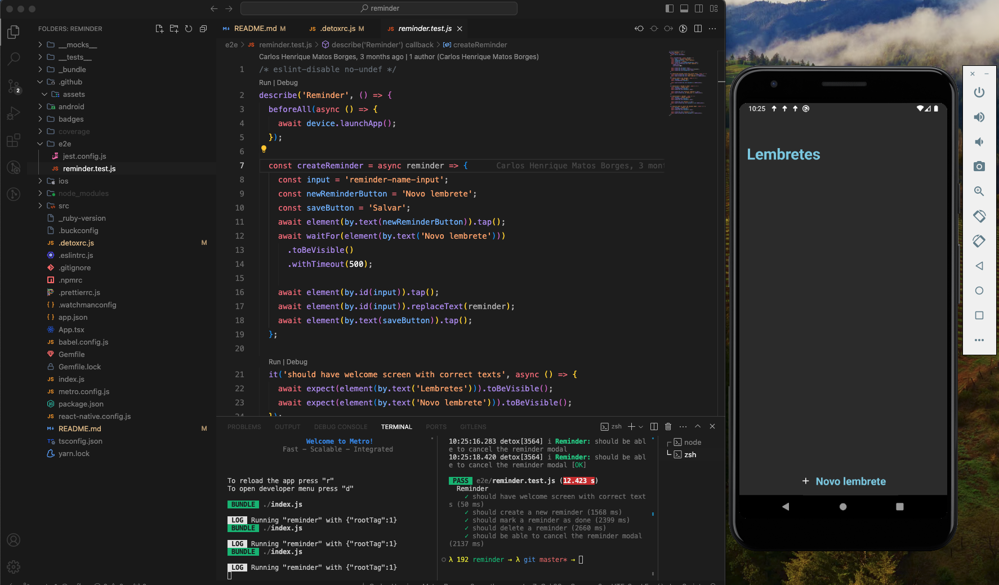

# Reminder 

## Description

  This application serves as a comprehensive task manager, meticulously designed to exemplify the meticulous process of functionality validation through both unit tests and end-to-end tests.

## Features

- Create a reminder
- Mark reminder as done
- Delete reminder
- Show reminder

## Test libraries

- Jest
- React Native Testing Library
- Detox (e2e)

## Screenshot

  

  
  
  
    
  

  

